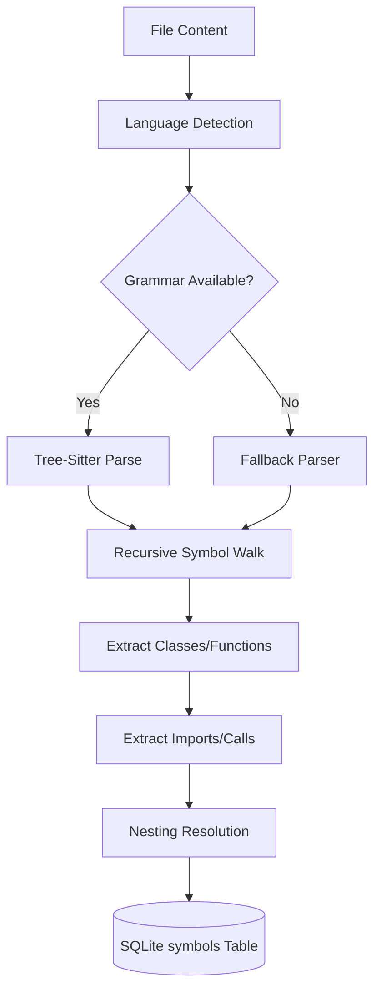

# A.E.G.I.S <small>CODEWORK v0.1.0</small>
# CodeIndex: Technical Design

This document details the AST parsing pipeline and semantic storage strategy.

## 📐 Architecture

### Core Components

| Component | Responsibility |
|-----------|----------------|
| `CodeIndexService` | Orchestrates the parsing lifecycle and SQLite persistence. |
| `TreeSitterParser` | Bridge to C-based Tree-Sitter grammars. |
| `SymbolConverter` | DTO layer that normalizes AST nodes into the `RawSymbol` model. |
| `FrameworkDetector` | Injects framework-specific metadata into extracted symbols. |

## 🔄 Parsing Pipeline

### Symbol Nesting Resolution
The `CodeIndexService` implements a two-pass resolution strategy for parent-child relationships:
1. **Pass 1**: Extract all symbols and assign them unique UUIDs. Store their "Code Reference" (e.g., `Class.Method`).
2. **Pass 2**: Iterate through symbols and resolve `parent_id` by matching Code References against the UUID map created in Pass 1.

## 💾 Data Model: `symbols` Table

| Field | Type | Description |
|-------|------|-------------|
| `id` | UUID | Unique identifier. |
| `repository_id` | UUID | Foreign key to `repositories`. |
| `parent_id` | UUID | Nullable; links to the parent symbol (e.g., Class). |
| `symbol_type` | Enum | `class`, `function`, `variable`, `interface`, etc. |
| `metadata` | JSON | Extended data: signatures, calls, docstrings. |
