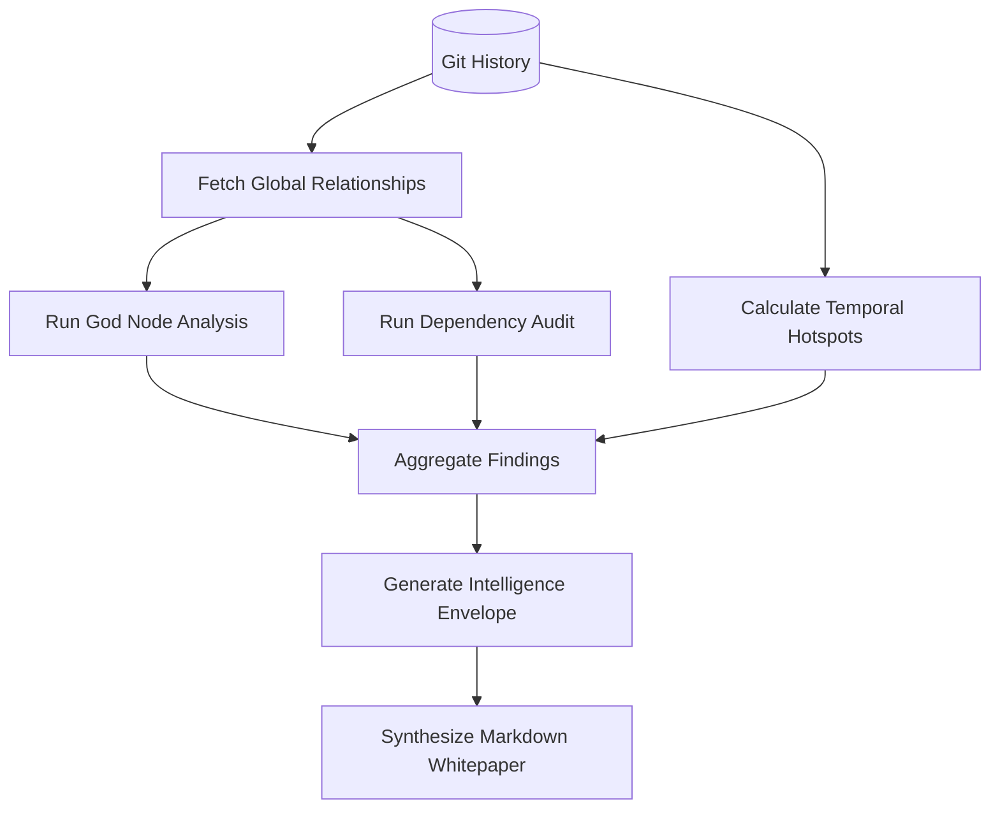

# A.E.G.I.S <small>CODEWORK v0.1.0</small>
# Feature: Graphify (Architectural Intelligence)

The **Graphify** domain is the analytical apex of CodeCortex. It synthesizes raw structural and semantic data into actionable architectural insights and high-craft intelligence reports.

## 📄 Concept

Graphify is where data becomes wisdom. It analyzes the "Living Network" created by CodeGraph to identify patterns, risks, and opportunities for optimization. It moves beyond "what the code is" to "how the system behaves."

### The "Aegis" Intelligence Standard
Graphify implements the Aegis standards for architectural health, ensuring that every codebase is evaluated against 2026 best practices for modularity, security, and maintainability.

## 🛠️ Technical Specification

### Analytical Engines
- **God Node Detector**: Identifies entities with excessive coupling or responsibility (High Fan-In/Fan-Out).
- **Temporal Hotspot Mapper**: Correlates high-frequency Git activity with code complexity to identify high-risk areas.
- **Dependency Auditor**: Detects circular dependencies and layer violations.
- **Security Scanner**: Pattern matching for hardcoded secrets and insecure coding practices within the AST.

### Report Generation
- **Intelligence Envelope**: A structured JSON object containing all analytical findings.
- **High-Craft Markdown**: A beautifully formatted, human-readable document designed for executive and technical review.

## 📐 Technical Design

### Core Components

| Component | Responsibility |
|-----------|----------------|
| `GraphifyService` | Orchestrates the analytical pipeline and report synthesis. |
| `PatternMatcher` | Logic for identifying structural anti-patterns. |
| `HotspotAnalyzer` | Integration with git history to calculate "Churn vs. Complexity" scores. |
| `MarkdownSynthesizer` | Template-based generation of human-readable documentation. |

### Architectural Metrics
Graphify tracks and evaluates the following:
- **Coupling Coefficient**: Measures how tightly integrated modules are.
- **Cyclomatic Complexity**: Measures the logical branchiness of functions.
- **Responsibility Score**: Measures the "weight" of a class or module in the overall graph.

### Analysis Workflow

