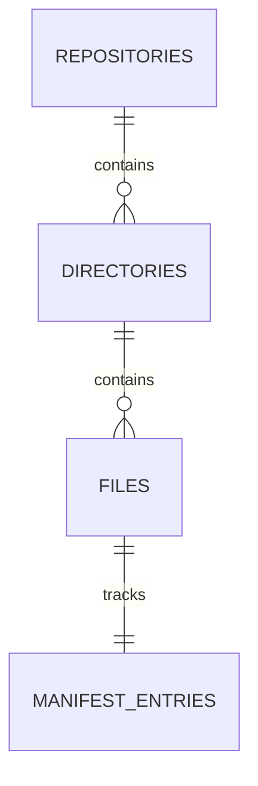

# A.E.G.I.S <small>CODEWORK v0.1.0</small>
# Repository Management: Technical Design

This document details the internal architecture and data flow of the Repository Management domain.

## 📐 Architecture

### Core Components

| Component | Responsibility |
|-----------|----------------|
| `RepositoryService` | Main entry point; orchestrates discovery and persistence. |
| `GitIgnoreFilter` | Uses `pathspec` to filter files based on project rules. |
| `FileClassifier` | Heuristic-based engine for assigning file categories. |
| `ManifestTracker` | Logic for delta detection and hash comparison. |

### Database Schema (Simplified)

## 🔄 Synchronization Flow

The `sync_repository` method follows these steps:

1. **Root Resolution**: Validates the physical path and assigns a `repository_id`.
2. **Rule Loading**: Loads the `.gitignore` file from the root and parses it into a filter object.
3. **Recursive Walk**:
    - Iterate through directories using `os.walk` or `pathlib.Path.iterdir`.
    - Skip ignored paths early to save I/O.
4. **File Processing**:
    - Check if the file exists in the `files` table.
    - If new: Calculate hash, classify, and insert.
    - If existing: Compare current hash with `manifest_entries.last_hash`.
    - Update `last_processed_at` if changed.
5. **Git Ingestion**: Trigger the `GitHistoryWorker` to pull commit metadata.

## 🚀 Performance Optimizations

- **Early Exit**: Directories listed in `.gitignore` are not traversed, significantly speeding up discovery for projects with large `node_modules` or `vendor` folders.
- **Batch Upserts**: Database operations are performed within a single transaction to minimize commit overhead.
