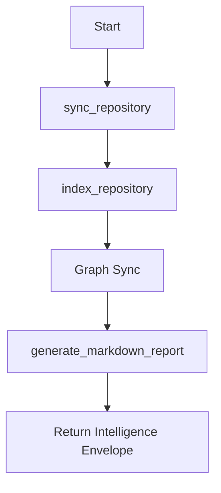
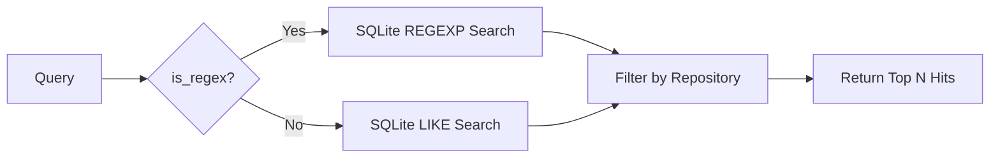
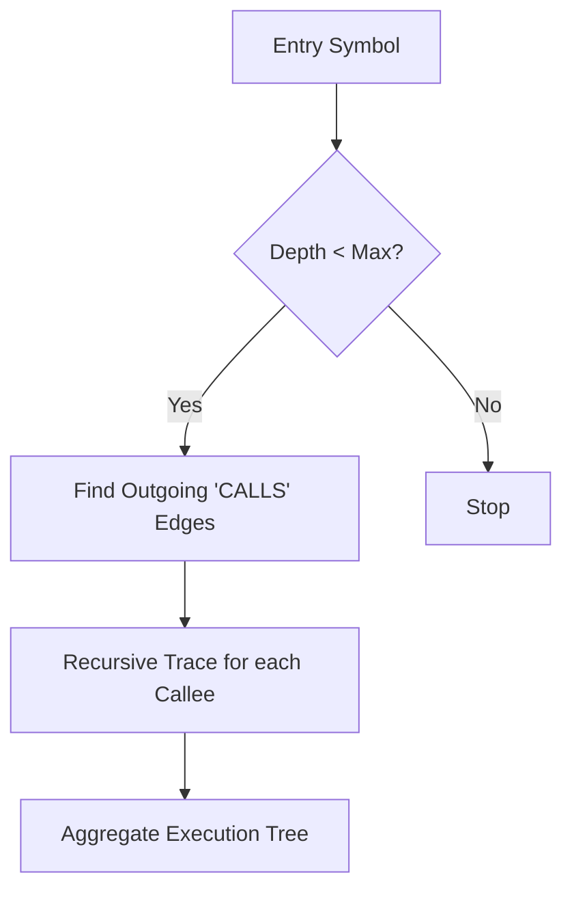

# A.E.G.I.S <small>CODEWORK v0.1.0</small>
# Guide: MCP Tools Operations

This guide details the logic, input requirements, and internal workflows of the CodeCortex MCP Toolset.

---

## 1. `analyze_codebase`
The "Big Red Button" for complete project understanding. It executes the entire intelligence pipeline in sequence.

### Flow

### Usage
- **Input**: `path` (Absolute path to repo).
- **Outcome**: A comprehensive architectural report including God Nodes, dependencies, and health metrics.

---

## 2. `search_symbols`
Performs semantic lookup across the entire indexed codebase.

### Flow

---

## 3. `get_architecture_summary`
Generates a high-craft, human-readable executive summary of the software architecture.

### Features
- **Vital Metrics**: LOC, File count, Symbol density.
- **Structural Integrity**: Identification of high-coupling "God Nodes."
- **Temporal Insight**: Mapping git hotspots to architectural complexity.

---

## 4. `get_structured_codemap`
Retrieves a hierarchical tree of the project's physical (files) and semantic (symbols) structure.

### Structure
- **Root**: Repository ID.
- **Level 1**: Directories.
- **Level 2**: Files.
- **Level 3+**: Nested Symbols (Classes -> Methods -> Variables).

---

## 5. `trace_execution_flow`
A recursive pathfinder that identifies how logic flows through the system.

### Flow

---

## 6. `reindex_codebase`
Handles delta updates to ensure the index stays in sync with developer changes.

### Logic
- **Delta Detection**: Compares current file hashes with the `manifest_entries` table.
- **Switching Strategy**:
    - If changes < `THRESHOLD` (Default 2000): Performs **Incremental Sync**.
    - If changes > `THRESHOLD`: Triggers **Full Re-indexing** for stability.
