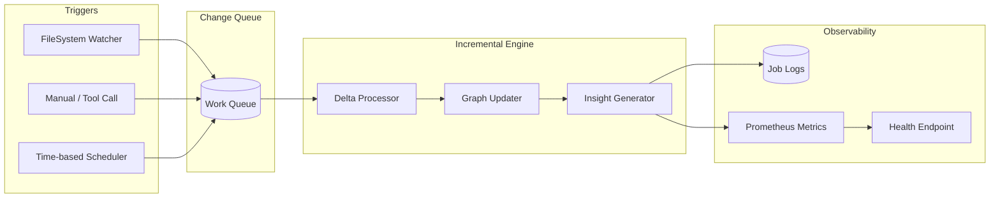

## CodeCortex Intelligence Engines Concept – Analytical Review & Strategic Upgrade

### Executive Summary

CodeCortex’s current design provides a solid foundation for static code intelligence through four well-defined domains (Repository, CodeIndex, CodeGraph, Graphify). However, to achieve its goal of continuous, up‑to‑date codebase understanding (codemap, flowmap, projectmap), it requires **two critical upgrades**: (1) an incremental scanning engine to avoid full‑reindex overhead, and (2) a periodic scheduling and observability layer to keep intelligence fresh autonomously.

This document synthesizes industry best practices from incremental SCA strategies, graph‑based code intelligence platforms, modern MCP tool patterns, and production‑grade indexing techniques. It delivers a **strengthened architectural roadmap** and a **complete set of MCP tools** designed for autonomous, scheduled intelligence generation.

---

## 1. Foundational Strengths & Identified Gaps

### 1.1 What Works Well

| Dimension | Current Strength | Evidence |
|-----------|------------------|----------|
| **Domain Separation** | Repository, CodeIndex, CodeGraph, Graphify follow DDD bounded contexts | Logical separation enables independent evolution |
| **AST Foundation** | Tree‑sitter multi‑grammar support for Python, TS, JS, Go | Aligned with modern practice |
| **Database Schema** | Normalised relational model with UUID primary keys and audit columns | Follows Aegis standards; supports basic traversal |
| **Output Contract** | Unified JSON intelligence envelope adhering to API standard | Consistent with SideCortex patterns |

### 1.2 Critical Gaps (Must Address)

| Gap | Impact | Priority |
|-----|--------|----------|
| **No incremental analysis** | Full tree re‑scan on every update → high latency, blocked on long jobs | Critical |
| **No scheduling / orchestration** | Intelligence only on‑demand; no background freshness assurance | Critical |
| **Graph queries are inefficient** | Relational `edges` table lacks native graph traversal capabilities | High |
| **No file system monitoring** | Cannot detect changes automatically → stale intelligence | High |
| **No observability for indexing** | Cannot track progress, detect hangs, or measure freshness | Medium |
| **Limited symbol resolution** | Cross‑file references may be incomplete without full‑project context | Medium |

---

## 2. Industry Benchmarking: What Successful Code Intelligence Systems Do

### 2.1 Incremental Strategies (The “Only What Changed” Principle)

Incremental scanning – analysing only the parts of the codebase that have changed – is now industry standard. Tools like Bito compare each commit against a previously reviewed state, identifying only added or modified sections. For large monorepos, incremental SCA reduces pipeline latency while maintaining security compliance.

**For CodeCortex**: Incremental update means re‑parsing only files with a new `content_hash`, then propagating changes to symbols and edges, rather than rebuilding the entire graph.

### 2.2 Graph Database for Code Relationships

Several platforms are converging on **graph databases** for code intelligence:

- **CodeGraph** creates a Code Property Graph (CPG) using Neo4j, capturing semantic relationships, control flow, and data flow.
- **CodeRAG** builds a comprehensive graph of classes, methods, and dependencies to enable AI deeper understanding.
- **gograph** stores Go codebase structure in Neo4j with Cypher queries for powerful dependency mapping.

For CodeCortex, adopting a graph layer (Neo4j or SQLite with graph extensions) transforms `edges` from passive relational records into **traversable relationships** supporting impact analysis, call hierarchy, and risk propagation.

### 2.3 MCP Code Intelligence Tools – Proven Patterns

Existing MCP servers offer valuable precedents:

| Toolset | Key Capabilities | Relevance |
|---------|------------------|-----------|
| **iflow‑mcp** | Call graph analysis via nuanced library | CodeGraph integration |
| **narsil‑mcp** | 90 tools, 32 languages, security scanning, call graphs | Comprehensive surface area |
| **mcp‑code‑indexer** | 11 tools for codebase navigation | Reference for tool design |
| **MCP Codebase Searcher** | Token‑efficient semantic search for LLMs | Search tool patterns |

### 2.4 Incremental & Change‑Driven Pipelines

The combination of a file system watcher (e.g., `watchdog` for Python) with an incremental indexing engine provides the foundation for continuous freshness. Changes detected at the filesystem level (create, modify, delete) trigger targeted re‑indexing of affected files and their dependents.

**For CodeCortex**: A `WatcherService` running in the background monitors `.gitignore`‑respecting paths, queues changed files, and invokes incremental update logic.

### 2.5 SQLite as Embedded Graph & Vector Store

Modern code intelligence tools increasingly leverage SQLite as a single‑file database combining graph traversal, full‑text search (FTS5), and vector similarity (sqlite‑vec). The `fluidstate.ai` code intelligence layer indexes codebases into a SQLite graph database with symbols, dependency edges, and PageRank.

**For CodeCortex**: SQLite (with graph extensions) eliminates external database dependencies while supporting efficient adjacency queries and full‑text symbol search – perfect for local‑first deployment.

---

## 3. Strengthened Architectural Design

### 3.1 Enhanced Domain Model (Additions)

```text
codecortex/
├── src/domain/
│   ├── repository/          (existing – file discovery)
│   ├── codeindex/           (existing – AST parsing)
│   ├── codegraph/           (existing – relationship building)
│   ├── graphify/            (existing – insight generation)
│   ├── incremental/         ➕ NEW – change detection & delta processing
│   │   ├── watcher.py       # File system monitoring
│   │   ├── queuer.py        # Change queue management
│   │   ├── delta_engine.py  # Incremental update logic
│   │   └── state.py         # Last‑indexed state tracking
│   └── scheduler/           ➕ NEW – periodic orchestration
│       ├── orchestrator.py  # Scheduling engine
│       ├── jobs.py          # Job definitions (full, incremental, insight)
│       └── observability.py # Progress tracking, metrics, alerts
```

### 3.2 Database Schema Enhancements

#### Additional Table: `change_log`

```sql
CREATE TABLE change_log (
    id UUID PRIMARY KEY,
    repository_id UUID NOT NULL REFERENCES repositories(id),
    file_path TEXT NOT NULL,
    change_type TEXT NOT NULL,  -- 'created', 'modified', 'deleted', 'renamed'
    detected_at TIMESTAMP NOT NULL,
    processed_at TIMESTAMP,
    content_hash_before TEXT,
    content_hash_after TEXT
);
```

#### Graph Optimisation View: `reified_edges`

```sql
CREATE VIEW reified_edges AS
SELECT 
    e.id,
    s.code as source_code,
    t.code as target_code,
    e.relation_type,
    e.weight
FROM edges e
JOIN symbols s ON e.source_id = s.id
JOIN symbols t ON e.target_id = t.id;
```

For advanced graph queries (e.g., “all functions that call function X with depth ≤3”), add optional Neo4j sync (external) or enable SQLite graph extensions with `WITH RECURSIVE` CTEs.

### 3.3 Incremental Update Algorithm

```
Algorithm: IncrementalUpdate(repository_path, changed_files_set)

1. For each file in changed_files_set:
   a. Compute new content_hash
   b. If file not in database → INSERT (new file)
   c. Else if content_hash != stored_hash → UPDATE
        i. Delete all symbols belonging to this file (cascade to edges)
        ii. Re-parse file with Tree‑sitter → new symbols
        iii. Insert new symbols
        iv. Schedule relationship resolution for all symbols in file
   d. Else if file marked deleted → SOFT DELETE (mark `deleted_at`)

2. Relationship resolution (batch):
   a. Collect all symbols from updated files
   b. For each symbol, resolve cross‑references across entire repository
   c. Generate edges (source → target) with relation_type and weight
   d. Insert edges in batch

3. Update repository.last_indexed_at

4. Trigger insight regeneration for affected symbols (if configured)
```

Time complexity: O(|changed_files| × avg_symbols_per_file + cross‑reference scanning). For large repos, cross‑reference scanning dominates; mitigate with index on `symbol.code` and selective re‑resolution.

### 3.4 Scheduling & Observability Architecture



---

## 4. Code Cortex MCP Tools – Complete Specification

All tools follow ExoCortex naming convention (`verb_noun`) and return structured payloads conforming to the API standard. Tools are organised into five functional groups.

### 4.1 Core Intelligence Tools

##### `index_repository`
*Purpose*: Trigger a full or incremental index of a repository.

| Parameter | Type | Required | Description |
|-----------|------|----------|-------------|
| `repository_path` | string | ✅ | Absolute path to project root |
| `mode` | string | ❌ | `full` (default) or `incremental` |
| `force` | boolean | ❌ | If `true`, purge existing data before indexing |
| `async` | boolean | ❌ | If `true`, return job_id immediately |

**Return** (sync mode):
```json
{
  "status": "success",
  "repository": { "id": "uuid", "name": "my-project", "root_path": "/path" },
  "stats": { "files_processed": 342, "symbols_extracted": 1289, "edges_created": 4567 },
  "duration_ms": 3450
}
```

**Return** (async mode):
```json
{
  "status": "accepted",
  "job_id": "job_abc123",
  "message": "Indexing started in background. Use get_job_status to track progress."
}
```

##### `get_code_map`
*Purpose*: Retrieve a hierarchical view of the codebase (files → symbols).

| Parameter | Type | Required | Description |
|-----------|------|----------|-------------|
| `repository_path` | string | ✅ | Absolute path |
| `depth` | integer | ❌ | Directory depth limit (default 3) |
| `include_symbols` | boolean | ❌ | If `false`, return only file/directory structure |
| `filter_type` | string | ❌ | `all`, `classes_only`, `functions_only` |

**Return**: JSON intelligence envelope with repository tree and symbol hierarchy.

##### `get_dependency_graph`
*Purpose*: Retrieve relationship graph for a symbol, file, or entire project.

| Parameter | Type | Required | Description |
|-----------|------|----------|-------------|
| `repository_path` | string | ✅ | Absolute path |
| `target` | string | ✅ | Target identifier (symbol code or file path) |
| `direction` | string | ❌ | `inbound` (callers), `outbound` (callees), `both` (default) |
| `depth` | integer | ❌ | Max traversal depth (default 2, max 5) |
| `format` | string | ❌ | `json` (default), `cypher`, `mermaid` |

**Return**:
```json
{
  "status": "success",
  "graph": {
    "nodes": [
      { "id": "src/auth.py:class:AuthService", "type": "class", "name": "AuthService" }
    ],
    "edges": [
      { "source": "src/main.py:func:main", "target": "src/auth.py:class:AuthService", "type": "USES" }
    ]
  },
  "stats": { "node_count": 24, "edge_count": 67 }
}
```

##### `search_codebase`
*Purpose*: Semantic or symbol‑based search across the indexed codebase.

| Parameter | Type | Required | Description |
|-----------|------|----------|-------------|
| `repository_path` | string | ✅ | Absolute path |
| `query` | string | ✅ | Search term (supports fuzzy matching) |
| `search_type` | string | ❌ | `symbol` (exact), `semantic` (embedding), `text` (full‑text) |
| `symbol_type` | string | ❌ | `class`, `function`, `method`, `variable` etc. |
| `limit` | integer | ❌ | Default 20 |

**Return**: List of matches with file location, line numbers, and surrounding context.

##### `get_symbol_detail`
*Purpose*: Retrieve complete information about a specific symbol.

| Parameter | Type | Required | Description |
|-----------|------|----------|-------------|
| `repository_path` | string | ✅ | Absolute path |
| `symbol_code` | string | ✅ | Unique symbol identifier (e.g., `src/auth.py:class:AuthService`) |

**Return**: Full symbol record including docstring, parameters, return type, definitions, and references.

### 4.2 Incremental & Scheduling Tools

##### `watch_repository`
*Purpose*: Start file system monitoring for a repository (incremental updates on changes).

| Parameter | Type | Required | Description |
|-----------|------|----------|-------------|
| `repository_path` | string | ✅ | Absolute path |
| `debounce_ms` | integer | ❌ | Delay before processing change events (default 1000) |
| `include_patterns` | array | ❌ | Glob patterns to include (default all code files) |
| `exclude_patterns` | array | ❌ | Glob patterns to exclude (default .git, node_modules, etc.) |

**Return**:
```json
{
  "status": "success",
  "watcher_id": "watch_abc123",
  "watching_path": "/path",
  "active": true
}
```

##### `stop_watching`
*Purpose*: Stop file system monitoring for a repository.

| Parameter | Type | Required | Description |
|-----------|------|----------|-------------|
| `watcher_id` | string | ✅ | Identifier returned from `watch_repository` |

**Return**: `{"status": "success", "stopped": true}`.

##### `schedule_indexing`
*Purpose*: Configure periodic full or incremental indexing.

| Parameter | Type | Required | Description |
|-----------|------|----------|-------------|
| `repository_path` | string | ✅ | Absolute path |
| `cron_schedule` | string | ✅ | Cron expression (e.g., `0 2 * * *` for daily at 2am) |
| `mode` | string | ❌ | `full` or `incremental` (default) |

**Return**:
```json
{
  "status": "success",
  "schedule_id": "sched_abc123",
  "next_run": "2026-05-03T02:00:00Z"
}
```

##### `get_job_status`
*Purpose*: Track progress of an async indexing job.

| Parameter | Type | Required | Description |
|-----------|------|----------|-------------|
| `job_id` | string | ✅ | Job identifier from async operation |

**Return**:
```json
{
  "status": "running",
  "job_id": "job_abc123",
  "progress_percent": 67.5,
  "current_phase": "Parsing symbols",
  "processed_files": 231,
  "total_files": 342,
  "started_at": "2026-05-02T10:00:00Z"
}
```

### 4.3 Analysis & Insight Tools

##### `get_flow_map`
*Purpose*: Extract call/control flow for a specific function or method.

| Parameter | Type | Required | Description |
|-----------|------|----------|-------------|
| `repository_path` | string | ✅ | Absolute path |
| `function_code` | string | ✅ | Symbol code of the function |
| `max_depth` | integer | ❌ | Default 3 |
| `include_conditional` | boolean | ❌ | Include conditional branches (default true) |

**Return**: Flow graph with sequential and branch nodes (format as `get_dependency_graph`).

##### `get_hotspots`
*Purpose*: Identify files/symbols with high complexity, coupling, or change frequency.

| Parameter | Type | Required | Description |
|-----------|------|----------|-------------|
| `repository_path` | string | ✅ | Absolute path |
| `metric` | string | ❌ | `complexity`, `coupling`, `change_frequency` (default all) |
| `limit` | integer | ❌ | Default 10 |

**Return**:
```json
{
  "status": "success",
  "hotspots": [
    {
      "file": "src/auth/service.py",
      "metric": "cognitive_complexity",
      "value": 47,
      "threshold_exceeded": true,
      "recommendation": "Refactor into smaller functions"
    }
  ]
}
```

##### `get_impact_analysis`
*Purpose*: For a given symbol, find all dependent symbols that would be affected by a change.

| Parameter | Type | Required | Description |
|-----------|------|----------|-------------|
| `repository_path` | string | ✅ | Absolute path |
| `symbol_code` | string | ✅ | Target symbol |
| `max_depth` | integer | ❌ | Default 3 |

**Return**: List of dependent symbols with depth and path information.

### 4.4 Maintenance & Utility Tools

##### `clean_index`
*Purpose*: Remove stale entries (deleted files, orphaned symbols) from the index.

| Parameter | Type | Required | Description |
|-----------|------|----------|-------------|
| `repository_path` | string | ✅ | Absolute path |
| `dry_run` | boolean | ❌ | If true, only report what would be deleted |

**Return**:
```json
{
  "status": "success",
  "stats": { "files_removed": 3, "symbols_removed": 28, "edges_removed": 156 }
}
```

##### `get_index_health`
*Purpose*: Retrieve health metrics for a repository’s index.

| Parameter | Type | Required | Description |
|-----------|------|----------|-------------|
| `repository_path` | string | ✅ | Absolute path |

**Return**:
```json
{
  "status": "success",
  "health": "good",
  "metrics": {
    "last_indexed_at": "2026-05-02T09:15:00Z",
    "index_freshness_hours": 2.5,
    "orphaned_symbols": 0,
    "total_symbols": 1289,
    "total_edges": 4567
  }
}
```

### 4.5 Export & Interoperability Tools

##### `export_code_map`
*Purpose*: Export the code map in various formats for external tools.

| Parameter | Type | Required | Description |
|-----------|------|----------|-------------|
| `repository_path` | string | ✅ | Absolute path |
| `format` | string | ❌ | `json` (default), `graphml`, `cypher` |

**Return**: File path or direct payload depending on format.

##### `sync_to_graph_db`
*Purpose*: Synchronise CodeCortex graph to external Neo4j instance for advanced queries.

| Parameter | Type | Required | Description |
|-----------|------|----------|-------------|
| `repository_path` | string | ✅ | Absolute path |
| `neo4j_uri` | string | ✅ | Bolt URI |
| `neo4j_user` | string | ✅ | Username |
| `neo4j_password` | string | ✅ | Password |

**Return**: `{"status": "success", "nodes_written": 1289, "edges_written": 4567}`.

---

## 5. Implementation Roadmap (Phased)

### Phase 1 (Baseline Enhancement – 2 weeks)
- ✅ Complete existing core domains (Repository, CodeIndex)
- ✅ Add `change_log` table and incremental update logic
- ✅ Implement `index_repository` with `incremental` mode
- ✅ Add basic `get_code_map` and `get_dependency_graph` tools

### Phase 2 (Scheduling & Observability – 2 weeks)
- ➕ Implement `schedule_indexing` with cron‑based executor
- ➕ Add file system watcher (`watch_repository`, `stop_watching`)
- ➕ Implement `get_job_status`, `get_index_health`, `clean_index`
- ➕ Add structured logging with `request_id` correlation

### Phase 3 (Advanced Analysis – 2 weeks)
- ➕ Implement `get_flow_map` (control flow extraction)
- ➕ Implement `get_hotspots` (metric distillation)
- ➕ Implement `get_impact_analysis` (dependency propagation)
- ➕ Add `search_codebase` with full‑text and semantic search

### Phase 4 (Interoperability & Optimisation – 1 week)
- ➕ Implement `export_code_map` and `sync_to_graph_db`
- ➕ Add graph query optimisation (index on `edges.source_code`, `edges.target_code`)
- ➕ Implement result caching for expensive queries

---

## 6. Validation Checklist (Release Gate)

- [ ] Full index < 5 minutes for 100k LOC repository
- [ ] Incremental update < 10 seconds for change affecting <10 files
- [ ] Watcher detects changes within 100ms of file system event
- [ ] All MCP tools return structured payloads conforming to API standard
- [ ] Tool schemas are validated with Pydantic or equivalent
- [ ] Logs are single‑line JSON with `request_id` and `context` fields
- [ ] No file system traversal beyond configured root (security)
- [ ] Unit test coverage ≥80% for incremental logic and graph traversal

---

## 7. Conclusion & Next Step

The strengthened CodeCortex concept now includes:
- **Incremental intelligence** via file system watcher and delta processing
- **Scheduled freshness** via cron‑based orchestration
- **Graph‑based code understanding** with support for external Neo4j sync
- **Complete MCP toolset** (19 tools across 5 functional groups) following ExoCortex naming conventions

**Next immediate action**: Implement Phase 1 (Baseline Enhancement) – existing core domains plus incremental update logic and basic query tools. This delivers a working MCP server capable of maintaining a fresh code map without manual full re‑indexing.

Would you like me to elaborate on any specific component (e.g., the incremental update algorithm implementation details, the file watcher architecture, or the graph query optimisation strategies)?