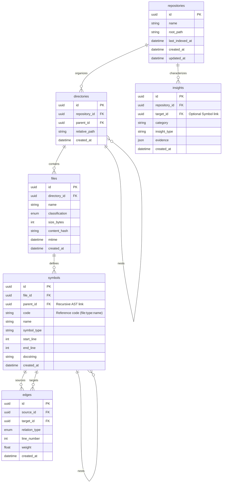

# CodeCortex Intelligence Engines Concept

CodeCortex is a unified intelligence engine designed to aggregate and synthesize code insights from multiple perspectives (Repository, Index, Graph) into a single, high-fidelity source of truth.

---

## Project Structure (Aegis Standard Compliance)
Aligned with `@docs/standards/project-structure-standard.md`:

```text
codecortex/
├── docs/                       # Project documentation (PRDs, Technical Specs)
├── scripts/                    # Entry points & automation
│   ├── server/                 # MCP Server implementations
│   └── setup.ps1               # Environment initialization
├── src/                        # Core source code
│   ├── core/                   # Shared services (Database, Logging)
│   ├── domain/                 # Bounded Contexts (DDD)
│   │   ├── repository/         # File discovery & ingestion
│   │   ├── codeindex/          # AST parsing & symbol intelligence
│   │   ├── codegraph/          # Relationship synthesis
│   │   └── graphify/           # Architectural insights
│   ├── infrastructure/         # External adapters (Tree-sitter)
│   └── main.py                 # Unified Orchestrator
└── tests/                      # Unit & integration tests
```

---

## Core Domains

### 1. Repository Domain: The Ingestion Gatekeeper
- **Logic Origin**: `src/domain/repository/`
- **Capabilities**:
    - **Path Normalization**: Absolute path enforcement & traversal protection.
    - **Asset Discovery**: Multi-threaded traversal with `.gitignore` compliance.
    - **File Classification**: Detecting `code`, `doc`, `config`, or `binary` assets.

### 2. CodeIndex Domain: The Intelligence Engine
- **Logic Origin**: `src/domain/codeindex/`
- **AST Architecture**:
    - **Tree-Sitter Multi-Grammar**: Standardized parsing for Py, TS, JS, Go.
    - **Selective Extraction**: Focus on Definitions (Class/Func), Structures (Imports), and References (Calls).
    - **Symbol Normalization**: Mapping language-specific AST nodes to Aegis `SymbolInfo` DTOs.

### 3. CodeGraph Domain: The Adjacency Matrix
- **Logic Origin**: `src/domain/codegraph/`
- **Capabilities**:
    - **Connectivity Mapping**: Building the relationship graph (`CALLS`, `INHERITS`, etc).
    - **Deterministic Codification**: Mapping symbols to unique reference codes for stable cross-file resolution.

### 4. Graphify Domain: The Insight Generator
- **Logic Origin**: `src/domain/graphify/`
- **Capabilities**:
    - **Metric Distillation**: Node centrality, coupling coefficients, and hot-path detection.
    - **Hygiene Enforcement**: Automated secret masking and document conversion.

---

## Unified Data Synthesis (Source of Truth)

### 1. Database Schema (Aegis Compliance)
Aligned with `@docs/standards/database-standard.md`. Tables use `snake_case`, UUID primary keys, and audit columns.



---

### 2. Unified JSON Intelligence Envelope
Aligned with `@docs/standards/api-standard.md`.

```json
{
  "status": "success",
  "data": {
    "repository": {
      "project_name": "codecortex",
      "tree": {
        "type": "directory",
        "name": "root",
        "children": []
      }
    },
    "code_intelligence": {
      "symbol_hierarchy": [
        {
          "code": "src/auth.py:class:AuthService",
          "name": "AuthService",
          "type": "class",
          "children": []
        }
      ],
      "relationships": [
        {
          "from": "src/main.py:func:main",
          "to": "src/auth.py:class:AuthService",
          "type": "USES",
          "line": 42
        }
      ]
    },
    "architectural_analysis": {
      "hotspots": [],
      "warnings": []
    }
  },
  "error": null,
  "metadata": {
    "version": "1.0.0",
    "timestamp": "ISO8601",
    "correlation_id": "uuid"
  }
}
```

---

## Analysis Flow: The "Context Tree" Journey
1. **Discovery (Repository)**: Recursive filesystem scan -> `directories` & `files` tables.
2. **Parsing (CodeIndex)**: Tree-sitter extraction -> `symbols` table (with AST nesting).
3. **Synthesis (CodeGraph)**: Cross-reference resolution -> `edges` table.
4. **Distillation (Graphify)**: Algorithmic processing -> `insights` table.
5. **Retrieval (Orchestrator)**: Unified query -> High-resolution **Codemap**.
