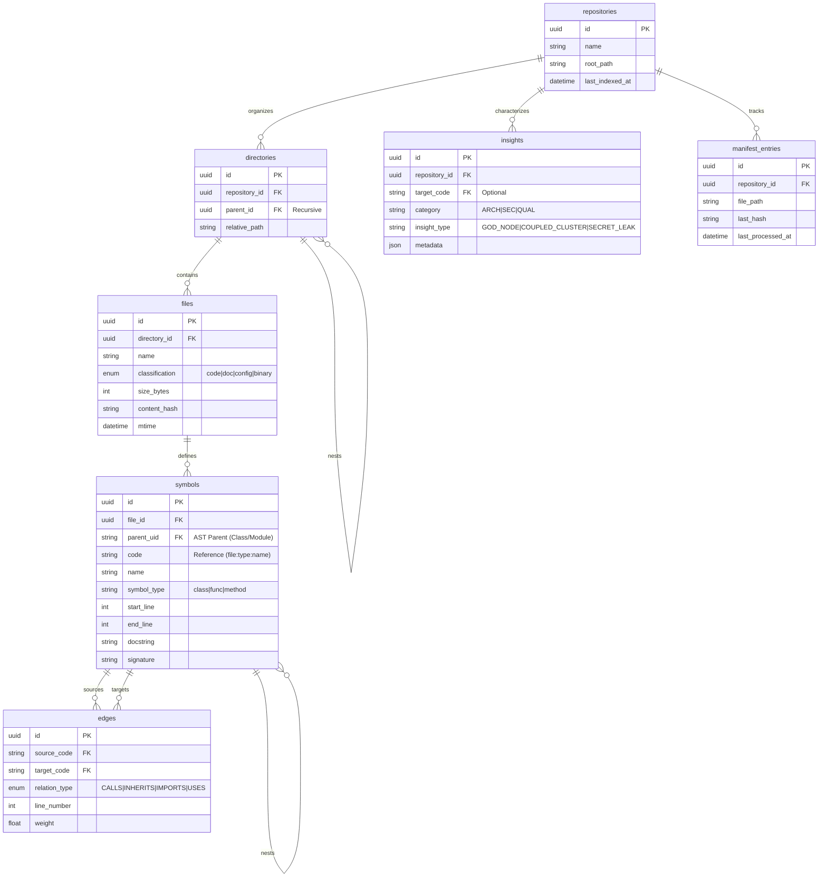

# CodeCortex Unified Intelligence Engine: Final Concept

CodeCortex is a multi-dimensional intelligence engine designed to provide a unified "Source of Truth" for any codebase. It synthesizes physical, semantic, and relational data into a high-fidelity Knowledge Graph.

---

## 1. Project Architecture (Aegis DDD Standard)
CodeCortex is organized into four synergistic domains:

1. **Repository (Discovery)**: Manages physical file assets, classifications, and safety gatekeeping.
2. **CodeIndex (Semantics)**: Extracts symbol definitions and AST hierarchies using Tree-Sitter.
3. **CodeGraph (Connectivity)**: Maps logical relationships (Calls, Imports, Inheritance) between symbols.
4. **Graphify (Architectural Intelligence)**: Runs network algorithms to identify God Nodes, Surprising Connections, and Modularity Clusters.

---

## 2. The Master Source of Truth (Database Schema)
The `codecortex.db` merges all domains into a relational model that preserves both **Physical Hierarchy** and **Semantic AST Hierarchy**.



---

## 3. High-Resolution Intelligence Capabilities

### A. The Unified Codemap
Synthesis of Folder Structure + AST Symbol Nesting + Relationship Connectivity.
- **Value**: Visualizes not just *where* code is, but *what* it is and *who* it talks to.

### B. Execution Flow Tracking (Front Controller Trace)
Recursive traversal of the `CALLS` graph starting from a designated entry point.
- **Value**: Identifies the "Happy Path" and uncovers **Dead Code** (unreachable from the entry point).

### C. Modularity & Coupling Audits
Graph-based analysis of component density.
- **Cohesion**: Strength of internal relationships within a module.
- **Coupling**: External dependencies that create architectural "Spaghetti".
- **God Nodes**: Identifying overloaded components that act as centralized points of failure.

### D. Smart Ingestion & Hygiene
- **Secret Masking**: Proactive exclusion of `.env`, certificates, and sensitive patterns.
- **Office Conversion**: Automated Markdown sidecar generation for `.docx`/`.xlsx` documentation.
- **Incremental Indexing**: Manifest-based processing to only analyze changed files (Delta Analysis).

---

## 4. Analysis Pipeline (The "Cortex Lifecycle")

1. **Discovery Phase**: `Repository` scans files, applies `.gitignore`, and checks `manifest_entries` for deltas.
2. **Hygiene Phase**: `Graphify` masks secrets and prepares documentation sidecars.
3. **Semantic Phase**: `CodeIndex` performs Tree-Sitter parsing to build the `symbols` hierarchy.
4. **Relational Phase**: `CodeGraph` resolves cross-file references to populate the `edges` matrix.
5. **Analytical Phase**: `Graphify` runs graph algorithms to generate `insights`.
6. **Synthesis Phase**: `Orchestrator` package everything into the **Unified Context Envelope**.

---

## 5. Unified Response Envelope (Aegis API Standard)
Standardized output for high-fidelity intelligence retrieval:

```json
{
  "status": "success",
  "data": {
    "repository": { "project": "codecortex", "tree": {} },
    "intelligence": {
      "symbol_hierarchy": [],
      "connectivity_graph": { "nodes": [], "edges": [] }
    },
    "architectural_insights": {
      "god_nodes": [],
      "coupling_warnings": [],
      "security_hygiene": []
    }
  },
  "error": null,
  "metadata": {
    "version": "1.0.0",
    "timestamp": "ISO8601",
    "correlation_id": "uuid"
  }
}
```
