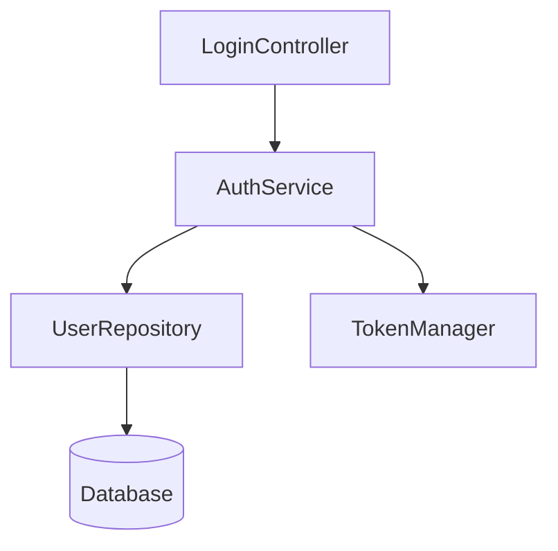

# WFK_ARC_001: Architecture Audit

> **Goal**: Assess structural health of a codebase — modularity, coupling, complexity, dead code, and community structure.
> **Trigger**: User asks for architecture review, wants to find god classes, check coupling, or visualize dependencies.
> **Time**: 1-3 minutes.
> **Cost**: Medium (graph build + multi-type audit + optional visualization).

---

## 1. Trigger Phrases

- *"Architecture review"*
- *"Find god classes"*
- *"Check coupling"*
- *"Dead code detection"*
- *"Circular dependencies"*
- *"How modular is this?"*
- *"Visualize the architecture"*
- *"Find the most complex files"*
- *"Community detection"*
- *"Architecture smells"*

---

## 2. Pipeline Overview

```
Step 1: Build Graph      (cb:graph:build)   ───┐
Step 2: Run Audit        (cb:graph:audit)   ───┤───► Deliverable
Step 3: Relationships    (cb:graph:relationships) ───┤
Step 4: Visualize        (CLI:cg:viz)           ───┘
```

---

## 3. Step 1 — Build Graph

**Purpose**: Construct the code relationship graph if not already present.

### MCP Call
```
MCP: codecortex:codebase
  action: "graph"
  repo_id: "<repo_id>"
  args: {
    sub_action: "build",
    detect_modular: true,
    build_dependency_graph: true,
    include_core_contracts: true,
    scan_hmvc_p: true,
    max_depth: 5,
    use_cache: true,
    include_stats: true
  }
```

### AI Must Read
| Field | Interpretation |
|-------|---------------|
| `nodes` | Total symbols in graph. |
| `edges` | Total relationships. |
| `graph_stats.density` | `< 0.01` = modular. `> 0.05` = tightly coupled. |
| `modular_summary.modules` | Detected module boundaries. |
| `modular_summary.plugins` | Plugin architecture detected? |
| `dependency_graph.layers` | Layered architecture detected? |
| `dependency_graph.circular_deps` | Already known cycles. |

### CLI
```bash
codecortex cg build /path/to/project --detect-modular --build-dependency-graph
```

---

## 4. Step 2 — Run Graph Audit

**Purpose**: Run the full architecture audit across all dimensions.

### MCP Call
```
MCP: codecortex:codebase
  action: "graph"
  repo_id: "<repo_id>"
  args: {
    sub_action: "audit",
    audit_types: ["god_nodes", "dead_code", "circular_deps", "coupling", "complexity", "communities", "security"],
    degree_threshold: 10,
    include_summary: true,
    limit: 50
  }
```

### Audit Types Explained

#### 4.1 God Nodes
Nodes with excessive in-degree (many things depend on them).

| Threshold | Risk |
|-----------|------|
| `in_degree > 30` | **God Class** — must split |
| `in_degree 20-30` | **Warning** — monitor |
| `in_degree < 20` | **Healthy** |

#### 4.2 Circular Dependencies
Cycles in the dependency graph.

| Count | Risk |
|-------|------|
| `> 0` | **BLOCKER** — breaks layering, complicates testing |
| `0` | **Healthy** |

#### 4.3 Coupling
Cross-module calls with high frequency.

| Score | Risk |
|-------|------|
| `> 0.7` | **High coupling** — modules not independent |
| `0.4-0.7` | **Moderate** — acceptable for related modules |
| `< 0.4` | **Loosely coupled** — ideal |

#### 4.4 Dead Code
Functions/classes with no callers.

| Count | Risk |
|-------|------|
| `> 20` | **Significant dead weight** — clean up |
| `10-20` | **Moderate** — review for library exports |
| `< 10` | **Healthy** |

#### 4.5 Complexity
Cyclomatic complexity per function.

| Complexity | Risk |
|------------|------|
| `> 25` | **Too complex** — must refactor |
| `15-25` | **Warning** — consider extraction |
| `10-15` | **Moderate** |
| `< 10` | **Healthy** |

#### 4.6 Communities
Leiden/Louvain clustering — natural module boundaries.

| Metric | Healthy |
|--------|---------|
| `count` | Aligned with intended modules |
| Cross-community edges | Minimal (< 10% of total) |
| Community size | Roughly balanced |

### Response Example
```json
{
  "god_nodes": [
    { "name": "Utils", "in_degree": 45, "file": "src/utils.py", "risk": "high" }
  ],
  "circular_deps": {
    "count": 3,
    "items": [
      { "cycle": ["A", "B", "C"], "files": ["src/a.py", "src/b.py", "src/c.py"] }
    ],
    "suggestions": ["Extract interface CInterface to break cycle"]
  },
  "coupling": [
    { "source": "auth", "target": "utils", "score": 0.85, "relation": "CALLS" }
  ],
  "dead_code": [
    { "name": "unusedFunc", "file": "src/legacy.py", "line": 5 }
  ],
  "complexity": [
    { "name": "processEverything", "complexity": 45, "file": "src/big.py" }
  ],
  "communities": {
    "count": 8,
    "clusters": {
      "0": ["auth", "users"],
      "1": ["orders", "payments"]
    }
  },
  "markdown_summary": "# Architectural Report\n\n## God Nodes..."
}
```

### CLI
```bash
codecortex cg audit <repo_id> --types god_nodes,circular_deps,coupling,dead_code,complexity,communities
```

---

## 5. Step 3 — Relationship Exploration

**Purpose**: Deep-dive into specific suspicious relationships.

### 5.1 Explore God Node Neighbors
```
MCP: codecortex:codebase
  action: "graph"
  repo_id: "<repo_id>"
  args: {
    sub_action: "relationships",
    target_node: "Utils",
    relation_type: "CALLS",
    direction: "both",
    depth: 2,
    include_community: true,
    min_confidence: "INFERRED",
    limit: 100
  }
```

### 5.2 Check Cross-Community Coupling
```
MCP: codecortex:codebase
  action: "graph"
  repo_id: "<repo_id>"
  args: {
    sub_action: "relationships",
    target_node: "auth::LoginController",
    relation_type: "CALLS",
    direction: "downstream",
    depth: 3,
    include_community: true
  }
```

**AI Insight**: If two nodes are in different communities but connected → **surprising coupling** that violates intended boundaries.

### Confidence Levels
| Level | Meaning | Use When |
|-------|---------|----------|
| `EXTRACTED` | Definite from AST | High-stakes decisions |
| `INFERRED` | Deduced from naming | Exploration, default |
| `AMBIGUOUS` | Uncertain | Broad search only |

---

## 6. Step 4 — Visualize

**Purpose**: Generate human-readable architecture diagrams.

### 6.1 Mermaid Diagram
```bash
codecortex cg query visualize OrderModule --repo-id <repo_id> --viz-format mermaid
```

Output:


### 6.2 DOT Format (for Graphviz)
```bash
codecortex cg query visualize OrderModule --repo-id <repo_id> --viz-format dot > arch.dot
dot -Tpng arch.dot -o arch.png
```

### 6.3 Full Architecture Summary
```bash
codecortex cg audit <repo_id> --types god_nodes,circular_deps --include-summary
```

---

## 7. Deliverable Format

```markdown
# Architecture Audit Report

## 1. Graph Summary
- **Nodes**: <N> symbols
- **Edges**: <N> relationships
- **Density**: <N> (< 0.01 = modular)
- **Components**: <N> (fragments)

## 2. God Nodes (Split Candidates)
| Name | In-Degree | File | Risk | Recommendation |
|------|-----------|------|------|----------------|
| Utils | 45 | src/utils.py | high | Split into domain-specific helpers |

## 3. Circular Dependencies
| Cycle | Files | Suggested Break |
|-------|-------|-----------------|
| A → B → C → A | a.py, b.py, c.py | Extract CInterface |

## 4. Coupling Matrix (Top 10)
| Source | Target | Score | Risk |
|--------|--------|-------|------|
| auth | utils | 0.85 | high |

## 5. Dead Code
| Name | File | Line | Action |
|------|------|------|--------|
| unusedFunc | src/legacy.py | 5 | Delete |

## 6. Complexity Hotspots
| Name | Complexity | File | Action |
|------|------------|------|--------|
| processEverything | 45 | src/big.py | Extract methods |

## 7. Community Detection
- **Clusters Found**: <N>
- **Natural Modules**: <list>
- **Cross-Community Edges**: <N> (< 10% is healthy)

## 8. Architecture Diagram
```mermaid
<diagram from cg viz>
```

## 9. Recommendations
1. **Immediate**: <high-impact, low-effort>
2. **Short-term**: <medium-effort>
3. **Long-term**: <structural changes>
```

---

## 8. Remediation Workflow

After the audit, use **WFK_RFC_001** (`safe-refactoring-workflow.md`) for safe refactoring:
1. `cb:refactor:impact` on god node → see blast radius
2. `cb:refactor:extract` to split god class
3. `cb:refactor:move` to break circular dependencies

---

## 9. AI Coder Optimization Guide

### Token Economy
| Technique | Token Saved | How |
|-----------|-------------|-----|
| `include_summary: true` + `limit: 20` | ~40% | Only top findings, not full list |
| Skip `communities` audit if only checking coupling | ~25% | Run targeted audit_types |
| `use_cache: true` for graph build | ~15% | Avoid rebuilding if fresh |
| Skip visualization (`CLI:cg:viz`) if user didn't ask | ~20% | Mermaid generation is expensive |

### Parallel Execution
- Step 1 (`cb:graph:build`) must complete before Step 2
- But Step 2 audit types can be split: `god_nodes` + `circular_deps` + `coupling` in parallel batches
- Step 3 (`cb:graph:relationships`) can run parallel with Step 4 (`CLI:cg:viz`) after audit completes

### Early Exit Conditions
| Condition | Action |
|-----------|--------|
| User asks "any circular deps?" | Run Step 2 with `audit_types: ["circular_deps"]` only |
| Graph already built in last session | Skip Step 1 entirely |
| `circular_deps.count == 0` AND no god nodes | Deliver early, skip remaining audits |

### Cache Reuse
- Graph build result is valid until `repo:sync` detects changes
- Audit results can be cached for 24h if codebase stable
- Use `cb:status --include-metrics` for quick re-check instead of full audit

---

*Cross-reference: [workflow-index.md](workflow-index.md) | [analysis-orchestra-workflow.md](analysis-orchestra-workflow.md)*
